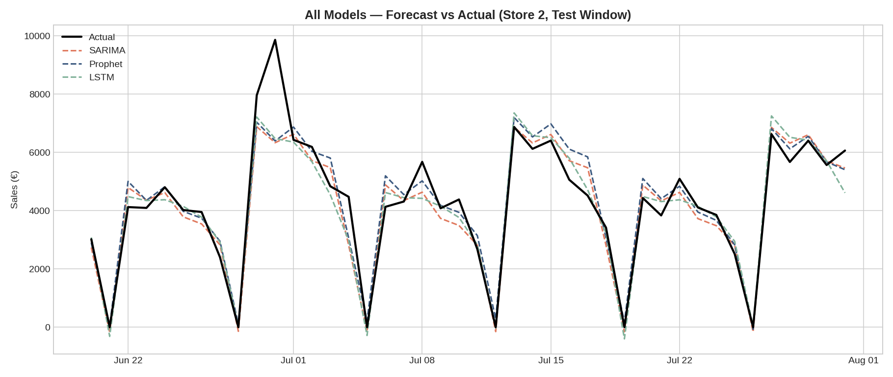

# Sales Forecasting: SARIMA vs Prophet vs LSTM

Time-series sales forecasting on real-world retail data, comparing three modeling
approaches — statistical (SARIMA), additive time-series (Prophet), and deep learning
(LSTM) — on the same train/test split.

## Overview

Retail sales are shaped by trend, seasonality, promotions, and holidays. This project
builds and evaluates three forecasting models on daily store sales from the
[Rossmann Store Sales](https://www.kaggle.com/c/rossmann-store-sales) dataset (1,115
European drugstores, Jan 2013 – Jul 2015), using Store #2 as the working example:

- **Trend** — gradual growth/decline in sales over 2.5 years
- **Weekly seasonality** — the store is closed every Sunday
- **Yearly seasonality** — holiday shopping peaks, slow periods
- **Promotions** — a `Promo` flag marking days with active promotions
- **Holidays** — state and school holidays that affect footfall and store closures

All three models are trained on the same data and evaluated on a held-out 6-week
test window using RMSE, MAE, and MAPE.

## Results

| Model   | RMSE | MAE | MAPE (open days) |
|---------|-----:|----:|------------------:|
| LSTM    | 742  | 458 | 9.59%             |
| SARIMA  | 764  | 502 | 11.19%            |
| Prophet | 768  | 501 | 11.25%            |

*(MAPE is computed only over days the store was open, to avoid divide-by-zero
errors on closed days with zero sales.)*



See `chart_per_model.png` for a per-model breakdown and `chart_full_history.png`
for the full 2.5-year sales history with the test window highlighted.

## Models

### SARIMA
`statsmodels` `SARIMAX` with order `(1,1,1)` and seasonal order `(1,1,1,7)`
(weekly seasonality), using `Promo` and `IsStateHoliday` as exogenous regressors.

### Prophet
Facebook/Meta's `prophet` library with yearly + weekly seasonality enabled,
a custom holidays dataframe built from state holiday dates, and `Promo` added
as an external regressor.

### LSTM
A 2-layer LSTM built in PyTorch, trained on a 14-day lookback window of scaled
sales + promo features, predicting the next day's sales.

## Project structure

```
.
├── forecasting_comparison.py   # end-to-end pipeline: load data, train all 3 models, plot results
├── requirements.txt             # Python dependencies
├── .gitignore
├── rossmann_train.csv          # daily sales data (1,115 stores, Jan 2013–Jul 2015)
├── rossmann_store.csv          # store metadata (type, assortment, competition distance, etc.)
├── model_metrics.csv           # RMSE / MAE / MAPE for each model (generated on run)
├── chart_full_history.png      # full sales history with test window highlighted
├── chart_per_model.png         # forecast vs actual, one panel per model
├── chart_combined.png          # all three forecasts overlaid on actuals
├── chart_error_comparison.png  # MAPE bar chart comparing all models
└── README.md
```

## Getting started

### Requirements

```bash
pip install -r requirements.txt
```

(Installs `pandas`, `numpy`, `matplotlib`, `scikit-learn`, `statsmodels`, `prophet`,
and `torch`. Prophet pulls in `cmdstanpy`/Stan on first install, which can take a
minute or two.)

### Run it

```bash
python forecasting_comparison.py
```

This will print RMSE/MAE/MAPE for each model to the console, save `model_metrics.csv`,
and regenerate all four PNG charts in the working directory.

### Use your own data / a different store

The dataset included is the full Rossmann `train.csv` and `store.csv`. To forecast a
different store, change `STORE_ID` at the top of `forecasting_comparison.py`. To use
your own sales data, replace the loading section (Section 1) with your own CSV, as
long as the result is a `daily` DataFrame indexed by date with a `Sales` column and any
regressor columns you want to use (e.g. promotions, holidays).

## Methodology notes

- **Train/test split**: the last 42 days (6 weeks) are held out as a test set; all
  models are trained only on data before that window.
- **Evaluation**: RMSE and MAE are computed over all test days; MAPE excludes days
  with zero sales (store closed) to avoid division-by-zero distortion.
- **Reproducibility**: the LSTM uses a fixed random seed (`torch.manual_seed(42)`)
  for consistent results across runs.

## Data source

[Rossmann Store Sales](https://www.kaggle.com/c/rossmann-store-sales) — originally
released as a Kaggle competition by Rossmann, a European drugstore chain. The dataset
includes ~2.5 years of daily sales for 1,115 stores along with store metadata
(store type, assortment level, competition distance, and promotion calendars).

## License

This project is provided under the MIT License. The Rossmann dataset is subject to
its original Kaggle competition terms.
